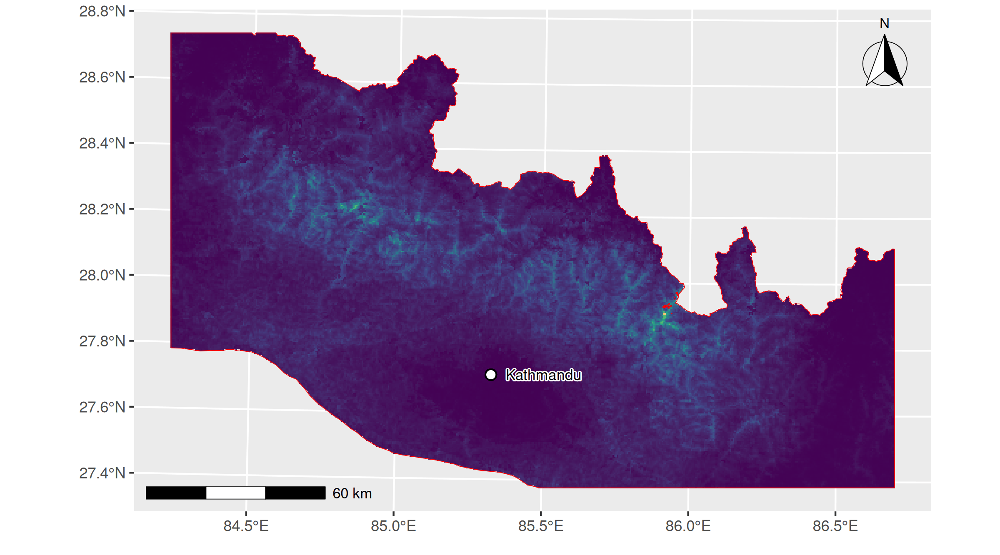

# Gorkha Earthquake Data Resources

## Description

This repository documents and references the geospatial datasets used for the joint modelling of earthquake-induced landslides (EQIL), centroid locations, and landslide sizes in square metres in Nepal following the 2015 Gorkha earthquake. The data include administrative boundaries, geology, elevation, land cover, rainfall, and landslide inventories.

<figure>
  
  <figcaption><strong>Figure:</strong> Animated landslide centroids (red) over the fit6a predicted occurrence susceptibility
    (intensity) surface from model fit6a using channel steepness index for 2015 Gorkha earthquake-induced landslides. </figcaption>
</figure>

## Model `fit6a`

`fit6a` is the main landslide susceptibility model used in this study. It estimates how landslide susceptibility varies across the study area.

In simplified form, the model is:

`log(lambda(s)) = beta0 + f1(PGA(s)) + f2(log(ksn(s))) + f3(Rainfall(s)) + beta * exp(-Fd2Ch(s)) + u(s)`

The model combines information on:

- earthquake shaking;
- topography, represented by `log(ksn)`;
- rainfall;
- distance to the nearest fluvial channel; and
- residual spatial patterns not captured by the mapped covariates.

Here, `lambda(s)` is the predicted landslide intensity or susceptibility at location `s`. The terms `f1`, `f2`, and `f3` allow flexible nonlinear relationships with shaking, channel steepness, and rainfall. The channel-distance term gives a stronger effect close to fluvial channels and a weaker effect farther away. The spatial random effect `u(s)` captures remaining spatial clustering not explained by the other variables.

In simple terms, `fit6a` predicts where landslides are more likely to occur based on shaking, landscape form, rainfall, proximity to channels, and unresolved spatial structure.

## Details
Technical details are provided in the accepted manuscript:

Suen, M. H., Naylor, M., Mudd, S., & Lindgren, F. (2026). *Influence of river incision on landslides triggered in Nepal by the Gorkha earthquake: Results from a pixel-based susceptibility model using inlabru*. Accepted for publication in *Frontiers in Earth Science: Geohazards and Georisks*.

For statistical details on spatial misalignment, see:

Suen, M. H., Naylor, M., \& Lindgren, F. (2026). *Coherent disaggregation and uncertainty quantification for spatially misaligned data*. *Environmetrics*, 37(2), e70078. https://onlinelibrary.wiley.com/doi/abs/10.1002/env.70078


### BibTeX

```bibtex
@article{suen2025influence,
  title={Influence of river incision on landslides triggered in Nepal by the Gorkha earthquake: Results from a pixel-based susceptibility model using inlabru},
  author={Suen, Man Ho and Naylor, Mark and Mudd, Simon and Lindgren, Finn},
  journal={arXiv preprint arXiv:2507.08742},
  year={2025}
}

@article{suen2026coherent,
  title={Coherent disaggregation and uncertainty quantification for spatially misaligned data},
  author={Suen, Man Ho and Naylor, Mark and Lindgren, Finn},
  journal={Environmetrics},
  volume={37},
  number={2},
  pages={e70078},
  year={2026},
  publisher={Wiley Online Library}
}
```

---

> **Note:** Some datasets are updated periodically. Always verify the latest versions via official portals (e.g. USGS, FAO, etc.).
> 
## 📁 Administrative Boundaries (Shapefiles)

**Main source:**  
- [Nepal Administrative Boundaries (WGS84)](https://opendatanepal.com/dataset/30a0bbef-a5df-43e9-b87f-b088fb502331/resource/016b2ecc-d890-4573-a29c-1d4b163475da/download/local_unit.zip)

---

## Landslide Inventories

### Valagussa et al. (2021)
- [Inventory & Bounding Box](https://www.sciencebase.gov/catalog/item/61f040e1d34e8b818adc3251)

---

## USGS Shape Map 

### USGS ShakeMap Atlas v4 
- [PGA](https://earthquake.usgs.gov/earthquakes/eventpage/us20002926/shakemap/pga)

---

## Land Cover Data

**FAO (2021):**  
_The Himalaya Regional Land Cover Database_  
- [Metadata & Access](https://data.apps.fao.org/map/catalog/srv/eng/catalog.search#/metadata/46d3c2ef-72c3-4f96-8e32-40723cd1847b)  

---

## 🪨 Geology

- [Geological Data of Nepal](https://www.researchgate.net/publication/259636889_Regional-scale_landslide_activity_and_landslide_susceptibility_zonation_in_the_Nepal_Himalaya)

---

## 🏔️ Digital Elevation Model (DEM)

- [Copernicus 30m DEM (OpenTopography)](https://opentopography.org/news/updated-copernicus-30m-DEM-available)

---

## Channel Steepness Data

- Channel steepness index and distance metric to channel raster maps of the Gorkha Earthquake 2015-affected area computed from DEM and processed with [LSDTopoTools](https://lsdtopotools.github.io/) ([doi:10.5281/zenodo.8076231](https://doi.org/10.5281/zenodo.8076231)), see `lsdtopotools_driver` folder for scripts and details.

---

## 🌧️ Annual Rainfall Data

- [CHIRPS v3 Rainfall Data](https://www.chc.ucsb.edu/data/chirps3)

---

## 🗺️ Raster Processing Note

- To fill the gaps caused by buffering between the study area and `nep_geo.shp`, use the script `nepal_geo_rast_fill.R`. This applies nearest-neighbour interpolation to ensure full coverage in the Gorkha district, making the raster suitable for subsequent spatial analysis.

---
## R code

- `compiler.R`: compiles and processes various geospatial datasets into a unified format for analysis and INLA spatial modelling via ```inlabru```.
- `tile_ldsize.R`: Plots the landslide inventory with PGA contour lines and histogram for landslides. 
- `mchi.R`: Plots the normalised channel steepness index (ksn) and channel profile analysis.
- `pred_zm.R`: Plots the posterior susceptibility map zoom-out.
- `coefvar.R`: Plots the coefficient of variation for the intensity and covariate effect maps.
- `summary_stat.R`: Summary statistics provided in Table 1.

---
## Citation

For attribution, please cite this work as: Suen, M. H., Naylor, M., Mudd, S., & Lindgren, F. (2025). Influence of river incision on landslides triggered in Nepal by the Gorkha earthquake: Results from a pixel-based susceptibility model using inlabru. arXiv preprint arXiv:2507.08742.


---
## Session Information

The code is currently developed and tested in R 4.6.0. Below is the session information for reproducibility:
```
> sessionInfo()
R version 4.6.0 (2026-04-24)
Platform: x86_64-pc-linux-gnu
Running under: Ubuntu 24.04.4 LTS

Matrix products: default
BLAS:   /usr/lib/x86_64-linux-gnu/openblas-pthread/libblas.so.3 
LAPACK: /usr/lib/x86_64-linux-gnu/openblas-pthread/libopenblasp-r0.3.26.so;  LAPACK version 3.12.0

locale:
 [1] LC_CTYPE=en_US.UTF-8       LC_NUMERIC=C              
 [3] LC_TIME=en_US.UTF-8        LC_COLLATE=en_US.UTF-8    
 [5] LC_MONETARY=en_US.UTF-8    LC_MESSAGES=en_US.UTF-8   
 [7] LC_PAPER=en_US.UTF-8       LC_NAME=C                 
 [9] LC_ADDRESS=C               LC_TELEPHONE=C            
[11] LC_MEASUREMENT=en_US.UTF-8 LC_IDENTIFICATION=C       

time zone: Etc/UTC
tzcode source: system (glibc)

attached base packages:
[1] stats     graphics  grDevices utils     datasets  methods   base     

other attached packages:
 [1] future_1.70.0   tidyterra_1.1.0 terra_1.9-27    ggplot2_4.0.3  
 [5] here_1.0.2      inlabru_2.14.1  INLA_26.05.10   Matrix_1.7-5   
 [9] fmesher_0.7.0   stars_0.7-2     sf_1.1-1        abind_1.4-8    
[13] dplyr_1.2.1     patchwork_1.3.2

loaded via a namespace (and not attached):
 [1] gtable_0.3.6       lattice_0.22-9     yyjsonr_0.1.22     vctrs_0.7.3       
 [5] tools_4.6.0        generics_0.1.4     curl_7.1.0         parallel_4.6.0    
 [9] tibble_3.3.1       proxy_0.4-29       pkgconfig_2.0.3    KernSmooth_2.23-26
[13] data.table_1.18.4  RColorBrewer_1.1-3 S7_0.2.2           lifecycle_1.0.5   
[17] compiler_4.6.0     farver_2.1.2       stringr_1.6.0      textshaping_1.0.5 
[21] codetools_0.2-20   nanoarrow_0.8.0    class_7.3-23       pillar_1.11.1     
[25] tidyr_1.3.2        classInt_0.4-11    wk_0.9.5           parallelly_1.47.0 
[29] gdalraster_2.6.1   tidyselect_1.2.1   digest_0.6.39      stringi_1.8.7     
[33] purrr_1.2.2        listenv_0.10.1     labeling_0.4.3     splines_4.6.0     
[37] rprojroot_2.1.1    grid_4.6.0         cli_3.6.6          magrittr_2.0.5    
[41] maptiles_0.11.0    e1071_1.7-17       withr_3.0.2        scales_1.4.0      
[45] sp_2.2-1           bit64_4.8.0        globals_0.19.1     bit_4.6.0         
[49] otel_0.2.0         ragg_1.5.2         ggspatial_1.1.10   splancs_2.01-45   
[53] viridisLite_0.4.3  rlang_1.2.0        isoband_0.3.0      Rcpp_1.1.1-1.1    
[57] glue_1.8.1         DBI_1.3.0          xml2_1.5.2         R6_2.6.1          
[61] systemfonts_1.3.2  units_1.0-1     
```
